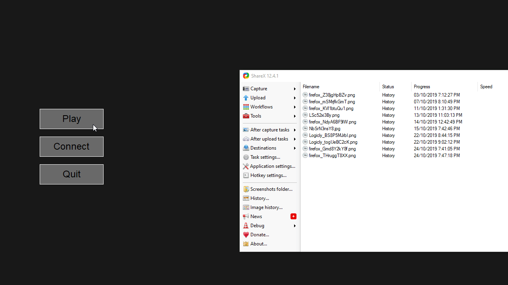

# SpaceFortress

A simple spaceshooter game made by using python 3.7.4 and the Zelle Graphics library.

## Demo


## Cloning
If you are too clone this project, here is the simple commands.
```
git clone https://github.com/TxJson/SpaceFortress [Location]
```

## Dependencies:
- [Python 3.7.4](https://www.python.org/downloads/release/python-374/)
- [Zelle Graphics Library](https://mcsp.wartburg.edu/zelle/python/graphics/graphics.pdf)

## Licensing

[GNU General Public License v3.0](https://github.com/TxJson/Spaceshooter/blob/master/LICENSE)
